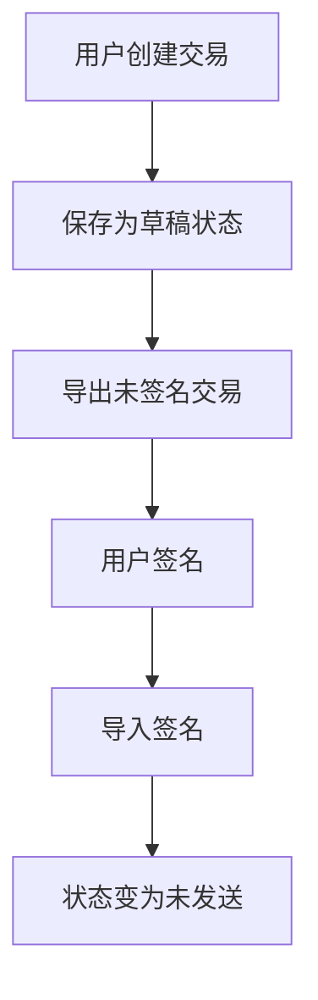
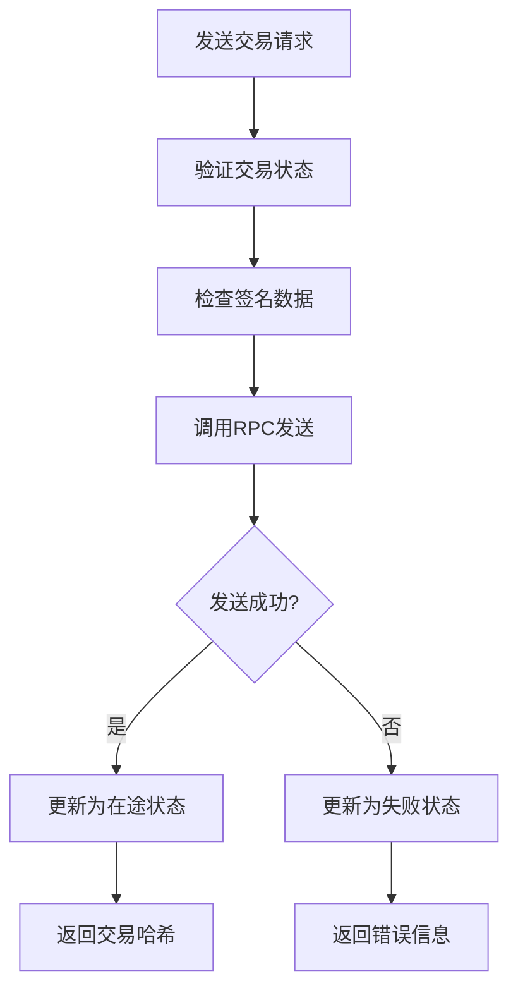
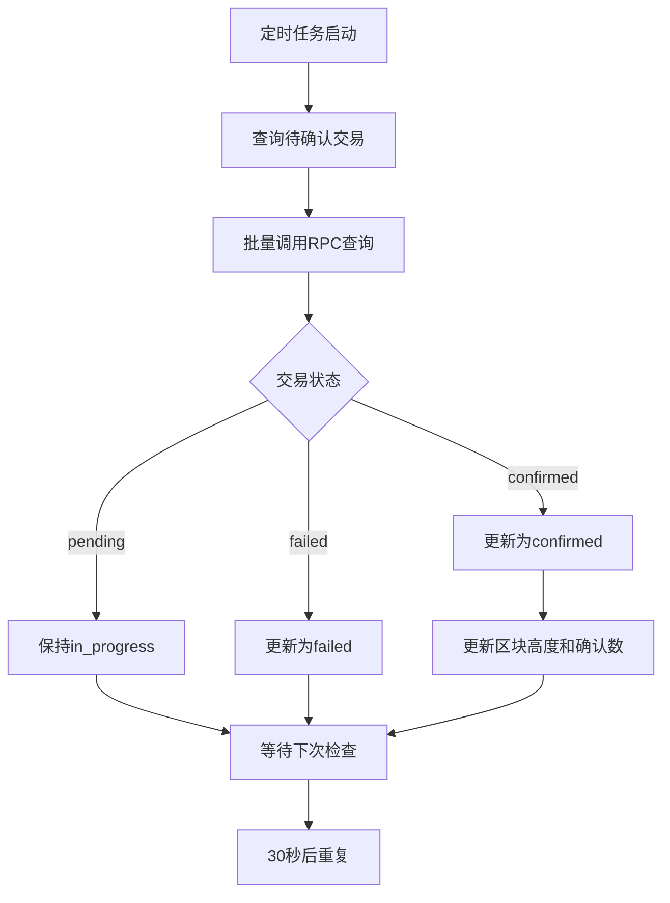

# RPC交易发送功能实现文档

## 概述

本文档描述了通过RPC调用发送区块链交易的功能实现，支持BTC和ETH链，包括ETH合约交易。

## 功能特性

### 支持的区块链
- **Bitcoin (BTC)**: 支持标准转账交易
- **Ethereum (ETH)**: 支持ETH转账和ERC-20代币合约交易

### 交易类型支持
1. **ETH原生转账**: ETH到ETH的转账
2. **ERC-20代币转账**: 代币合约调用
3. **ERC-20授权**: approve操作
4. **ERC-20授权转账**: transferFrom操作
5. **BTC转账**: 标准比特币转账

## 架构设计

### 核心组件

#### 1. RPCClientManager
- **位置**: `server/internal/utils/rpc_client_manager.go`
- **功能**: 管理多个区块链的RPC客户端连接
- **特性**:
  - 支持多链配置
  - 自动故障转移
  - 连接池管理

#### 2. UserTransactionService
- **位置**: `server/internal/services/user_transaction_service.go`
- **功能**: 用户交易业务逻辑处理
- **新增方法**:
  - `SendTransaction()`: 发送交易到区块链
  - `updateTransactionStatusAsync()`: 异步更新交易状态（内部方法）

#### 3. TransactionStatusScheduler
- **位置**: `server/internal/services/transaction_status_scheduler.go`
- **功能**: 定时任务调度器，自动更新交易状态
- **特性**:
  - 每30秒检查一次待确认交易
  - 自动查询区块链状态并更新数据库
  - 支持批量状态更新

#### 4. UserTransactionHandler
- **位置**: `server/internal/handlers/user_transaction_handler.go`
- **功能**: HTTP API处理器
- **新增端点**:
  - `POST /api/v1/user-transactions/:id/send`: 发送交易

## 配置要求

### 配置文件 (config.yaml)

```yaml
blockchain:
  chains:
    btc:
      chain_id: 0
      name: "Bitcoin"
      symbol: "BTC"
      decimals: 8
      enabled: true
      rpc_url: "http://127.0.0.1:8332"
      username: "bitcoin"
      password: "bitcoin123"
    eth:
      chain_id: 11155111
      name: "Ethereum"
      symbol: "ETH"
      decimals: 18
      enabled: true
      rpc_url: "https://your-eth-rpc-url"
```

## API使用示例

### 1. 发送交易

**请求**:
```http
POST /api/v1/user-transactions/123/send
Authorization: Bearer <jwt_token>
```

**响应**:
```json
{
  "success": true,
  "message": "发送交易成功",
  "data": {
    "id": 123,
    "status": "in_progress",
    "tx_hash": "0x1234567890abcdef...",
    "chain": "eth",
    "symbol": "ETH",
    "from_address": "0x742d35Cc6634C0532925a3b8D4C9db96C4b4d8b6",
    "to_address": "0x76f10e1367447cf60C720696b40e57C7df9e08f7",
    "amount": "1000000000000000000",
    "fee": "21000000000000000"
  }
}
```

### 2. 自动状态更新

交易状态现在通过以下方式自动更新：

1. **发送交易后**: 立即异步查询一次状态
2. **定时任务**: 每30秒检查所有待确认交易
3. **状态变化**: 自动更新数据库中的交易状态

**状态更新流程**:
- `in_progress` → `confirmed` (交易确认)
- `in_progress` → `failed` (交易失败)
- `packed` → `confirmed` (交易确认)

## 交易流程

### 1. 创建交易


### 2. 发送交易


### 3. 自动状态更新


## 错误处理

### 常见错误码

| 错误码 | 描述 | 解决方案 |
|--------|------|----------|
| `UNSUPPORTED_CHAIN` | 不支持的链类型 | 检查链配置 |
| `RPC_CLIENT_NOT_AVAILABLE` | RPC客户端未配置 | 检查RPC URL配置 |
| `INVALID_TX_DATA` | 无效的交易数据 | 检查签名数据格式 |
| `SEND_TX_FAILED` | 发送交易失败 | 检查网络和Gas设置 |

### 错误响应示例

```json
{
  "success": false,
  "message": "发送交易失败: insufficient funds for gas",
  "error_code": "SEND_TX_FAILED"
}
```

## 安全考虑

### 1. 交易验证
- 验证交易签名
- 检查交易状态
- 确认用户权限

### 2. RPC安全
- 使用HTTPS连接
- 配置认证信息
- 限制访问权限

### 3. 数据保护
- 敏感信息加密存储
- 交易数据完整性检查
- 审计日志记录

## 性能优化

### 1. 连接池
- 复用RPC连接
- 自动重连机制
- 连接超时设置

### 2. 异步处理
- 异步发送交易
- 后台状态更新
- 批量状态查询

### 3. 缓存策略
- 交易状态缓存
- 区块高度缓存
- 网络状态缓存

## 监控和日志

### 1. 关键指标
- 交易发送成功率
- RPC响应时间
- 交易确认时间
- 错误率统计

### 2. 日志记录
```go
s.logger.Infof("交易发送成功: ID=%d, TxHash=%s", userTx.ID, sendResp.TxHash)
s.logger.Errorf("发送交易失败: %v", err)
```

### 3. 告警机制
- RPC连接失败告警
- 交易发送失败告警
- 高错误率告警

## 测试建议

### 1. 单元测试
- RPC客户端连接测试
- 交易数据解析测试
- 错误处理测试

### 2. 集成测试
- 端到端交易流程测试
- 多链支持测试
- 故障转移测试

### 3. 压力测试
- 并发交易发送测试
- RPC连接池压力测试
- 大量交易状态查询测试

## 部署注意事项

### 1. 环境配置
- 确保RPC节点可访问
- 配置正确的网络参数
- 设置合适的超时时间

### 2. 安全配置
- 使用生产级RPC节点
- 配置防火墙规则
- 启用HTTPS和认证

### 3. 监控配置
- 配置日志收集
- 设置性能监控
- 建立告警机制

## 扩展功能

### 1. 多链支持
- 添加新的区块链支持
- 实现链特定的交易逻辑
- 支持跨链交易

### 2. 高级功能
- 批量交易发送
- 交易优先级设置
- 动态Gas价格调整

### 3. 用户体验
- 实时交易状态更新
- 交易历史查询
- 交易费用估算

## 总结

RPC交易发送功能提供了完整的区块链交易处理能力，支持BTC和ETH链，包括合约交易。通过模块化设计和错误处理机制，确保了系统的稳定性和可扩展性。建议在生产环境中进行充分的测试和监控配置。
